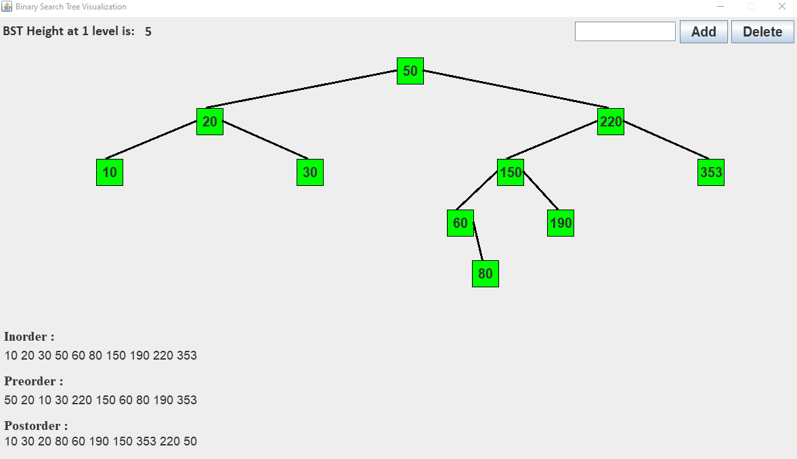
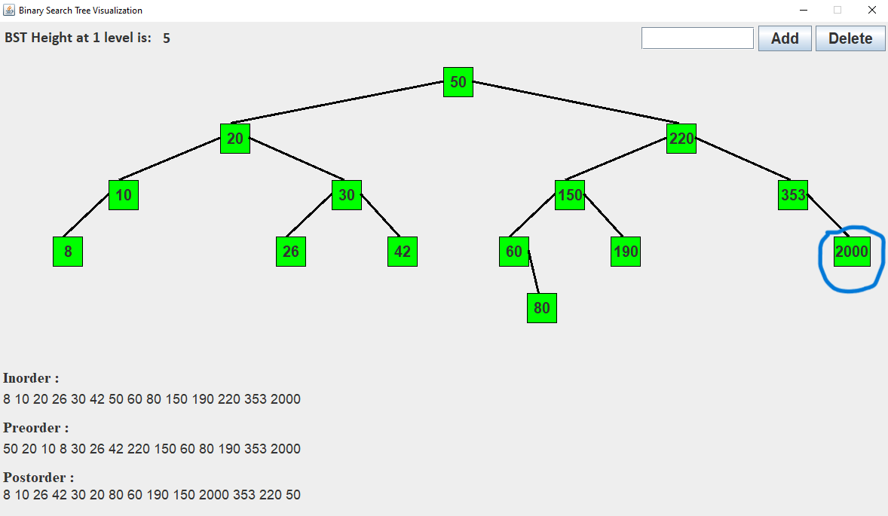
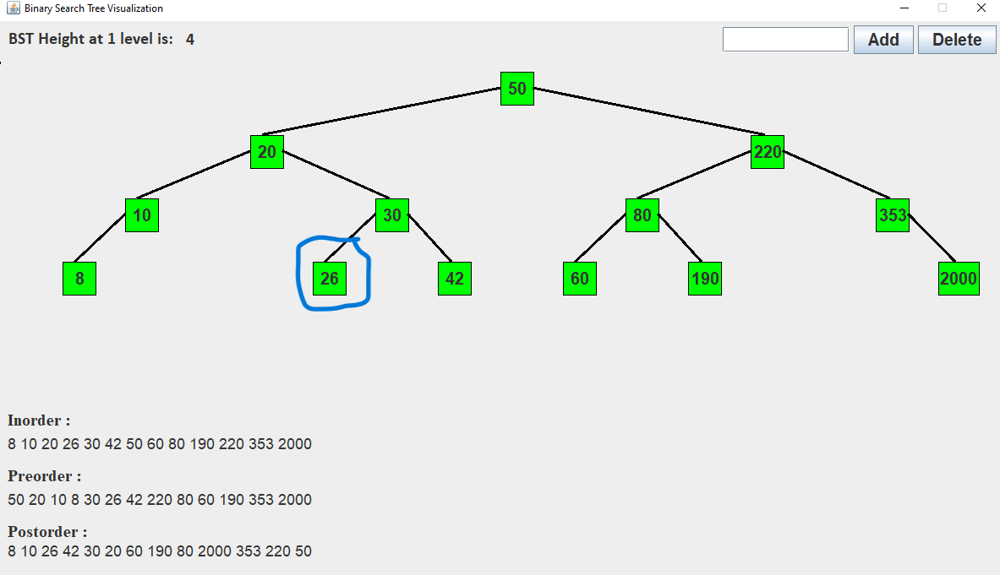
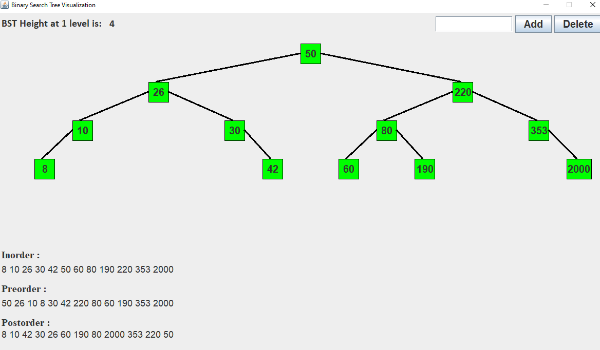

# Binary Search Tree (BST) Visualization

## Overview
<p align="justify">This project is a Java application that visually represents a Binary Search Tree (BST) using Swing for the GUI. It allows users to add and delete nodes, and provides a visual representation of the tree structure, including in-order, pre-order, and post-order traversals.</p>

## Features
- **Visual Representation**: Provides a graphical visualization of the BST.
- **Node Operations**: Allows adding and deleting nodes in the BST.
- **Traversal Display**: Shows in-order, pre-order, and post-order traversals.
- **Height Calculation**: Displays the height of the BST.

## Requirements
- Java Development Kit (JDK) 1.8 or above.

## Installation and Running
1. **Ensure Java is installed**:
   - You need Java installed on your computer to compile and run this application. You can download it from [Oracle's website](https://www.oracle.com/java/technologies/javase-jdk11-downloads.html) if it's not already installed.

2. **Download the source code**:
   - Download the source files to your local machine.

3. **Compile the Program**:
   - Open your terminal or command prompt.
   - Navigate to the directory where the file is stored.
   - Compile the code using the following command:
     ```bash
     javac BSTVisualization.java
     ```

4. **Run the Compiled Program**:
   - Run the program with the following command:
     ```bash
     java BSTVisualization
     ```

## Usage
- **Add Node**:
  - Enter the integer value in the text field at the top right.
  - Click the "Add" button or press the 'A' key to add the node to the BST.
- **Delete Node**:
  - Enter the integer value in the text field at the top right.
  - Click the "Delete" button or press the 'D' key to delete the node from the BST.

## Classes and Methods

### `BSTVisualization`
This is the main class that extends `JFrame` and implements `ActionListener` and `KeyListener`.

#### Fields
- `root`: The root node of the BST.
- Various `JPanel`, `JButton`, `JTextField`, and `JLabel` components for the GUI.

#### Methods
- **Constructor `BSTVisualization()`**: Initializes the GUI components and sets up the frame.
- **`initialize()`**: Sets up the layout and components of the GUI.
- **`paint(Graphics g)`**: Overrides the paint method to draw the lines connecting nodes.
- **`actionPerformed(ActionEvent evt)`**: Handles button click events for adding and deleting nodes.
- **`keyTyped(KeyEvent evt)`, `keyPressed(KeyEvent evt)`, `keyReleased(KeyEvent evt)`**: Handles keyboard events for adding and deleting nodes.
- **`add(int info)`**: Adds a new node to the BST.
- **`delete(int data)`**: Deletes a node from the BST.
- **`setInfo()`**: Updates the traversal and height information.
- **`calculateHeight(Node root)`**: Recursively calculates the height of the BST.
- **`reArrangeNode(Node node, Node pre, int X)`**: Rearranges the nodes after adding or deleting a node.

### Nested Classes
- **`Node`**: Represents a node in the BST with fields for data, left and right children, and position.
- **`Points`**: Stores coordinates for drawing lines between nodes.
- **`Height`**: Stores the height information of the BST.

## Example Usage
Upon running the program, the application window will display the BST with the initial nodes added in the `main` method:
- Nodes with values 50, 220, 353, 20, 150, 190, 30, 60, 80, and 10 are added to the BST.

## Conclusion
<p align="justify">This Java application provides a visual and interactive way to understand and manipulate a Binary Search Tree. It serves as an educational tool for learning about BSTs and their properties.</p>

## Future Enhancements
- Adding more complex tree operations such as balancing.
- Improving the visual design and interaction capabilities.
- Adding functionalities to save and load BSTs.

### Output Screen

- Initial stage of BST.
#### Starting point of BST
  

- After Adding the some element in BST
#### Addition of element of BST
   


-  After deletion of some elements in BST
#### Deletion of element of BST
  


-  After deletion of some elements in BST
#### Deletion of element of BST
  
